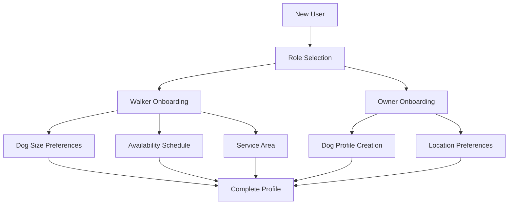
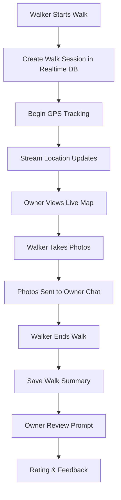

# DogWalk – Product Requirements Document (PRD)

**Version:** 2.0  
**Owner:** Bob Banana (Solo Developer)  
**Last Updated:** December 2024  

---

## 1. Purpose & Vision
DogWalk is an Android-only, ephemeral communication platform that connects dog walkers with dog owners. The app enables real-time GPS tracking during walks, secure messaging with time-limited media, and a discovery system for matching walkers with compatible clients based on location, dog size, availability, and ratings.

---

## 2. Goals & Non‑Goals
|                   | Included in MVP | Out of Scope for MVP |
|-------------------|-----------------|----------------------|
| GPS walk tracking with live path drawing | ✔ | Historical walk analytics |
| Walker-Owner matching algorithm | ✔ | Advanced AI matching |
| Real-time location sharing during walks | ✔ | Background location always-on |
| Ephemeral messaging with TTL | ✔ | Voice/video calls |
| Post-walk review system (1-5 stars) | ✔ | Dispute resolution system |
| Walker public profiles with walk history | ✔ | Walker verification/background checks |
| Role-based onboarding (Walker vs Owner) | ✔ | Role switching |
| Walk stories (24h expiration) | ✔ | Story comments/reactions |
| Walk session photo sharing | ✔ | Video during walks |
| Offline walk tracking with sync | ✔ | Advanced offline features |
| Monetization / payments | ✖ | In-app payments/booking |
| Push notifications | ✖ | Real-time walk alerts |

---

## 3. Personas
* **Professional Dog Walker** – Manages multiple clients, wants to showcase reliability and build reputation
* **Casual Walker** – Part-time walker looking to earn extra income, focuses on local neighborhood  
* **Busy Owner** – Working professional who needs regular walking services and peace of mind through tracking
* **Protective Owner** – Highly concerned about dog safety, wants detailed walk updates and GPS monitoring

---

## 4. Success Metrics
| Metric | Target |
|--------|--------|
| Monthly Active Users (beta) | 150 walkers + 300 owners |
| Successful walk completions | ≥ 95% |
| Average walker rating | ≥ 4.2/5.0 |
| GPS tracking accuracy | ≥ 95% location points within 10m |
| Walk photo sharing rate | ≥ 80% of walks |
| User retention (30-day) | ≥ 60% |
| Cold‑start time | ≤ 3 s |
| Bundle size | ≤ 45 MB |

---

## 5. Feature Scope (MVP)

## 5.1 Navigation & Core Screens

### Bottom Tab Bar (left ➜ right)

| Position | Tab | Primary Content | Icon Suggestion |
|----------|-----|-----------------|-----------------|
| 1 | **Stories** | Walk stories feed (all walkers' recent walks) | `📖` or Timeline |
| 2 | **Find** | Walker-Owner matching and discovery | `🔍` or Search |
| 3 | **Camera**  (Raised‑center, 1.2× size) | Walk photo capture & story posting | `📷` (filled) |
| 4 | **Chats** | Walker-Owner private conversations | `💬` speech‑bubble |
| 5 | **Profile** | Role-specific profile management | `👤` user‑circle |

* The **Camera** tab is a floating‑action style button: centered, elevated 4 dp above the bar, 60 dp diameter, brand green background, white camera icon.

* **Stories** uses infinite scroll for walker walk posts. **Find** shows filtered results based on user role and preferences.

* The bar adapts based on user role - walkers see camera for posting walks, owners see it for dog photos.

| ID | Feature | Key Details |
|----|---------|-------------|
| F1 | **Role-Based Authentication** | Email/password & Google sign‑in with walker/owner selection |
| F2 | **User Onboarding** | Role-specific profile setup with dog info, preferences, availability |
| F3 | **GPS Walk Tracking** | Real-time location sharing via Firebase Realtime DB with path drawing |
| F4 | **Walker-Owner Matching** | Location, dog size, availability, rating-based discovery system |
| F5 | **Ephemeral Messaging** | Walker-owner chat with photo sharing and TTL enforcement |
| F6 | **Walk Sessions** | Start/stop walks with live tracking, photo capture, and client notifications |
| F7 | **Review System** | Post-walk 5-star rating with comments, integrated into profiles |
| F8 | **Walk Stories** | Public walker posts showing recent walks (24h expiration) |
| F9 | **Profile Management** | Walker portfolios with walk history, owner dog profiles |
| F10 | **Walk History** | Past walk summaries with duration, distance, photos (walkers only) |

---

## 6. Non‑Functional Requirements
* **Performance:** GPS updates ≤ 5s intervals; cold start ≤ 3 s; 60 fps during map interactions  
* **Location Accuracy:** ≥ 95% GPS points within 10m actual location
* **Battery Efficiency:** GPS tracking ≤ 15% battery drain per hour
* **Offline Support:** Walk tracking continues without internet, syncs when connected
* **Privacy:** Location data auto-deleted after 24h, chat encryption for sensitive data
* **Scalability:** Support 500 concurrent walk sessions (beta target)

---

## 7. Technical Architecture

### 7.1 User Role System

### 7.2 Walk Session Flow

### 7.3 Data Storage Strategy
* **Firestore**: User profiles, walk summaries, reviews, messages
* **Realtime Database**: Live GPS coordinates, active walk sessions
* **Cloud Storage**: Walk photos, dog profile pictures
* **Local Storage**: Offline walk data, cached user preferences

---

## 8. Milestones & Timeline

| Milestone | Goal | Deliverables |
|-----------|------|--------------|
| **M0** | Environment & Models | Firebase setup, data models, role system |
| **M1** | Auth & Onboarding | F1, F2 - Role selection and profile setup |
| **M2** | GPS & Tracking | F3, F6 - Real-time location, walk sessions |
| **M3** | Communication | F5 - Walker-owner messaging system |
| **M4** | Discovery & Matching | F4 - Find screen with filtering algorithm |
| **M5** | Reviews & Stories | F7, F8 - Rating system and walk story posts |
| **M6** | Profile & History | F9, F10 - Complete profile management |
| **M7** | Beta Release | Testing, optimization, Play Store |

---

## 9. Detailed Feature Specifications

### 9.1 Walker Profile Requirements
- **Service Areas**: City/neighborhood selection
- **Dog Size Preferences**: Small (< 25 lbs), Medium (25-60 lbs), Large (60+ lbs) - multi-select
- **Walk Duration**: 15 min, 30 min, 45 min, 60+ min options
- **Availability**: Morning (6-11 AM), Afternoon (11-4 PM), Evening (4-8 PM)
- **Walk History**: Display last 10 walks as list + 3 most recent as featured cards
- **Rating Display**: Average stars + total review count
- **Profile Photo**: Required for trust-building

### 9.2 Owner Profile Requirements  
- **Dog Information**: Name, age, breed, size category, gender
- **Dog Photo**: Required for walker identification
- **Dog Bio**: 500 character limit for personality, special needs, preferences
- **Location**: City/neighborhood for matching
- **Preferred Walk Duration**: Same options as walkers
- **Special Instructions**: Additional notes for walkers

### 9.3 GPS Tracking Specifications
- **Update Frequency**: Every 5 seconds during active walks
- **Accuracy Requirement**: ≤ 10 meter deviation from actual location
- **Path Smoothing**: Connect GPS points with smooth curves, not straight lines
- **Offline Handling**: Store locations locally, batch upload when connected
- **Battery Optimization**: Use location updates only during active walks

### 9.4 Matching Algorithm Logic
1. **Hard Filters**: Same city + compatible dog size + availability overlap
2. **Scoring Factors**:
   - Distance from owner (closer = higher score)
   - Walker rating (higher = higher score)  
   - Number of completed walks (more = higher score)
   - Matching availability windows (more overlap = higher score)
3. **Result Display**: Sort by total score, show top 20 matches

### 9.5 Review System Requirements
- **Trigger**: Automatic prompt when owner opens chat after walk completion
- **Components**: 1-5 star rating + optional 500 character comment
- **Display**: Walker profiles show average rating and recent reviews
- **Privacy**: Owner names in reviews show first name + last initial only

---

## 10. Risks & Mitigations

| Risk | Mitigation |
|------|------------|
| GPS tracking drains battery quickly | Optimize update frequency, pause when stationary |
| Walkers fake GPS locations | Implement movement pattern validation |
| No walkers in user's area | Expand radius gradually, suggest nearby cities |
| Safety concerns with real-time tracking | Add emergency contact features in v1.1 |
| Photos shared inappropriately | Add photo reporting system |
| Poor walker-owner matches | Iterate on algorithm based on success rates |

---

## 11. Future Enhancements (Post-MVP)
* **Booking System**: Schedule walks in advance with calendar integration
* **Payment Integration**: In-app payments and automatic walker payouts  
* **Walk Analytics**: Distance, pace, route optimization insights
* **Emergency Features**: Panic button, emergency contacts, check-in requirements
* **Group Walks**: Multiple dogs from different owners in single walk
* **Walk Preferences**: Favorite routes, park preferences, weather considerations
* **Advanced Matching**: Behavioral compatibility, special needs matching
* **Walker Teams**: Business accounts for professional walking services

---

## 12. Success Criteria & KPIs

### 12.1 User Acquisition
- **Target**: 150 walkers + 300 owners in first 3 months
- **Walker-to-Owner Ratio**: Maintain 1:2 ratio for healthy marketplace
- **Geographic Coverage**: Launch in 3 cities, expand based on density

### 12.2 Engagement Metrics
- **Walk Completion Rate**: ≥ 95% of started walks completed successfully
- **Photo Sharing**: ≥ 80% of walks include at least 2 photos
- **Review Rate**: ≥ 70% of walks receive owner reviews
- **Return Usage**: ≥ 60% of users active after 30 days

### 12.3 Quality Metrics
- **Average Rating**: Maintain ≥ 4.2/5.0 walker average
- **GPS Accuracy**: ≥ 95% of location points within acceptable range
- **App Performance**: ≤ 2% crash rate, ≤ 3s cold start time

---

<small>© 2024 DogWalk – internal use only</small>
